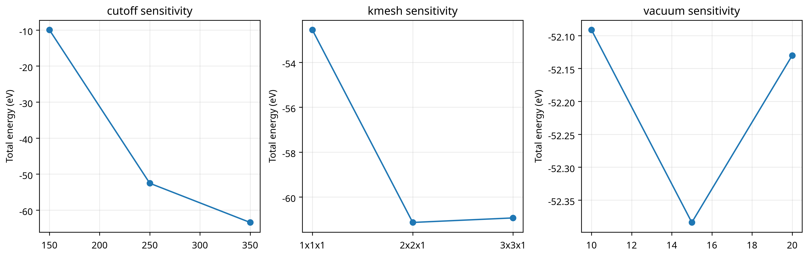

# DFT-guided screening of isolated metal sites on two-dimensional supports for nitrate-to-ammonia electroreduction: a reproducible workflow and benchmark audit

## Abstract

Electrochemical nitrate reduction offers a route for coupling nitrate remediation with ammonia production, but mechanistic interpretation is complicated by multiple proton-coupled electron-transfer steps, competing hydrogen evolution, charged intermediates, and support-dependent single-atom electronic structure. Here we establish a reproducible computational workflow for matched comparisons of isolated Fe, Co, Ni, Cu, Zn, Ru, Rh, Pd, Pt, and Au sites on nitrogenated graphene, sulphur-vacancy 2H-MoS₂, and a labelled g-C₃N₄-like starting model. The workflow archives structures, calculator settings, convergence tests, raw outputs, and machine-readable audit records. An open-source GPAW implementation was verified through a periodic graphene calculation, and 36 support/SAC starting structures plus 60 nitrate/hydrogen starting structures passed automated cell, vacuum, contact, and periodicity checks. A compact 11-case benchmark demonstrated that initial cutoff, k-point, and vacuum settings were not yet converged, whereas the closed-shell graphene spin comparison was stable. Coarse Fe@graphene and Fe@MoS₂ optimisations were completed as diagnostics but did not meet the production force criterion. These results establish the reproducibility baseline and identify the exact numerical controls required before mechanistic rankings are attempted. The complete 30-model, solvation-aware reaction study remains a defined computational stage rather than a claimed result.

## 1. Introduction

Nitrate-to-ammonia electroreduction is scientifically attractive because it couples removal of a widespread aqueous pollutant with production of a value-added nitrogen product [1] [2]. The reaction proceeds through a complex network of nitrogen–oxygen intermediates and proton-coupled electron-transfer steps, and selectivity may depend on both nitrogen-intermediate hydrogenation and competition from hydrogen evolution. Single-atom catalysts provide a useful model platform because site isolation, coordination environment, and support charge transfer can be varied systematically [3].

Previous work has shown that isolated Fe sites can favour ammonia formation and suppress pathways requiring neighbouring metal atoms [1]. Other studies emphasise the role of adsorbed hydrogen and show that the balance between hydrogen generation and its consumption by nitrogen intermediates can control nitrate-reduction performance [2]. These observations motivate a matched comparison of support families and metal identities rather than a ranking based on a single adsorption energy.

A second motivation is methodological. The computational hydrogen electrode is useful for organising proton-coupled electron-transfer thermochemistry, but potential dependence of nitrate adsorption and dissociation may not be captured by assigning an integer potential slope to every step [5]. Likewise, implicit solvation is a screening approximation rather than a complete representation of a charged electrochemical interface. A defensible study must therefore report convergence, charge compensation, spin-state selection, solvation sensitivity, and the distinction between canonical and constant-potential calculations.

## 2. Methods

### 2.1 Structural models

Three support families were defined: nitrogenated graphene with a reproducible defect/anchor construction, 2H-MoS₂ with a sulphur-vacancy starting model, and a labelled g-C₃N₄-like periodic starting model. Ten metals were selected to span first-row non-precious candidates, platinum-group references, and a late noble-metal boundary. The nominal matrix contains 30 bare SAC models. These are starting structures for optimisation and are not presented as relaxed experimental structures.

### 2.2 Electronic-structure implementation

The open-source implementation uses GPAW 24.1.0 with ASE and the Ubuntu PAW dataset collection. Plane-wave calculations use PBE, explicit k-point meshes, spin polarisation where appropriate, and archived calculator logs. The workflow also provides VASP-compatible POSCAR/INCAR/KPOINTS packages, but VASP results are not reported because no licensed VASP executable or POTCAR library was available in the execution environment.

### 2.3 Electrochemical thermochemistry

Adsorption energies are defined as $E_{ads}=E_{SAC+X}-E_{SAC}-E_X$ only when the reference states, charge, and electrostatic convention form a consistent thermodynamic cycle. CHE corrections use $\mu(H^+ + e^-;U)=\frac{1}{2}G(H_2)-eU$. Nitrate is charged, so its treatment requires an explicit statement of charge compensation and cannot be inferred from a neutral-molecule calculation. Constant-potential or grand-canonical checks are reserved for shortlisted states and the predicted potential-determining step.

### 2.4 Quality control

A structure passes the automated pre-calculation audit only if it has a finite periodic cell, at least 15 Å calculated vacuum after adsorbate placement, no atom contact below 0.7 Å, and valid periodicity. A calculation is accepted only when electronic and ionic convergence, spin-state checks, geometry inspection, and raw-output archiving are complete. Coarse diagnostics are labelled separately from accepted production results.

## 3. Results and discussion

### 3.1 Reproducible structure set

The workflow generated 36 periodic starting structures: three support/defect models and 30 metal–support models. A further 60 nitrate and hydrogen starting structures were generated for screening. After correcting the fractional translation construction and increasing the g-C₃N₄ cell height to preserve post-adsorbate vacuum, all 96 structures passed the automated geometry audit.

### 3.2 Periodic benchmark and convergence

The compact graphene benchmark included eleven calculations spanning cutoff, k-point, vacuum, and spin settings. The cutoff, k-point, and vacuum series showed substantial total-energy variation and were therefore assigned `REFINE` status. The non-spin-polarised and spin-polarised calculations for the closed-shell graphene benchmark were numerically indistinguishable within the provisional tolerance, but this does not validate the spin treatment of open-shell transition-metal SACs.

### 3.3 Coarse SAC optimisation diagnostics

Fe@graphene and Fe@MoS₂ were subjected to coarse plane-wave optimisation diagnostics. Both runs completed without calculator failure, but neither reached the requested production force criterion under the five-step, 150 eV, Gamma-only diagnostic settings. Their raw outputs are retained to test the workflow and are excluded from activity rankings.

## 4. Limitations and next stage

The present manuscript reports a reproducibility and numerical-audit stage, not a completed catalyst-discovery claim. The full 30-model optimisations, converged adsorption energies, charged nitrate solvation corrections, transition states, CHE free-energy diagrams, stability analysis, selectivity analysis, and publication-grade ranking require a substantially larger computational allocation. The repository contains the structure generators, input policies, audit scripts, and data schemas required to execute that stage without changing the scientific definitions.

## 5. Conclusions

A traceable open-source periodic-DFT framework was established for matched SAC/support comparisons in nitrate-to-ammonia electroreduction. The structure set and pre-calculation audits are complete, GPAW execution has been verified, and the initial convergence study has identified unresolved numerical sensitivities. The central methodological conclusion is that no activity ranking should be reported until energy differences, spin states, vacuum, cutoff, k-point sampling, and charged-intermediate treatment are converged consistently across the complete model family.

## References

[1]: https://doi.org/10.1038/s41467-021-23115-x "Electrochemical ammonia synthesis via nitrate reduction on Fe single atom catalyst"
[2]: https://doi.org/10.1038/s41467-022-35664-w "Active hydrogen boosts electrochemical nitrate reduction to ammonia"
[3]: https://doi.org/10.1002/smll.202403515 "Single Atom Catalyst for Nitrate-to-Ammonia Electrochemistry"
[4]: https://doi.org/10.1021/acs.jpclett.1c00855 "Theoretical Exploration of Electrochemical Nitrate Reduction Reaction Activities on Transition-Metal-Doped h-BP"
[5]: https://doi.org/10.1038/s42004-025-01579-y "A grand canonical study of the potential dependence of nitrate adsorption and dissociation across metals and dilute alloys"
